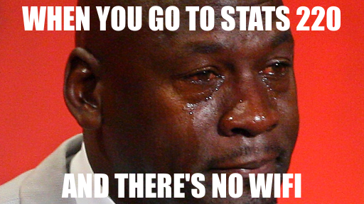

```{r setup, include=FALSE}
knitr::opts_chunk$set(echo=TRUE, message=FALSE, warning=FALSE, error=FALSE)
```

```{css}

h1, h2, h3 {
  background-color: #F0F0F0;
  width: fit-content;
  padding: 16px;
  border-radius: 18px;
  box-shadow: 0px 8px 12px #C0C0C0;
  transition: all 0.25s;
}

h2, h3 {
  padding: 12px;
  border-radius: 14px;
  box-shadow: 0px 4px 6px #CFCFCF;
  transition: all 0.25s;
}

img {
  border-width: 4px;
  border-style: solid;
  border-color: #C0C0C0;
  border-radius: 12px;
  margin: 8px 0px;
  box-shadow: 0px 4px 6px #E0E0E0;
}

h2:hover, h3:hover {
  transform: scale(1.025);
  box-shadow: 0px 8px 12px #C0C0C0;
  transition: all 0.25s;
}

```

## Project requirements
Project Screenshot: 

[Github Repo]("https://www.github.com/mikais13/stats220")

## Inspo meme


The main components of this meme is the image of Michael Jordan crying during his induction speech for the basketball hall of fame, and the two strings of text on the top and bottom, which together describe an unfortunate circumstance that can make a person want to cry.

## My meme


I have altered the text to be about how sad it was when we has no wifi during one of our lectures. I have done this because I have never personally dipped a cookie in milk and had it break, whereas I know that all of the STATS 220 students have experienced the wifi failures that happen at university. As a result, I feel that this new version of the meme is more relatable to other students.

## My animated meme 


## Creativity
I have demonstrated creativity through multiple ways. One of which is the use of the `image_draw()` function to draw on teardrops to Michael Jordan's face for my animated GIF. This is a function from the `magick` package which we have not been taught how to use, which I have implemented so that we do not need to load in an image to add as a circle, extending beyond the method shown in the lab. In Part F, I have included a plethora of CSS changes, such as altering the headers to have a background color that jumps off the page, and hence a shadow, and also rounded corners for aesthetics. Less significant headers have a smaller profile, and hence a lighter shadow and smaller border-radius. I have also wrapped images in a light grey border, introduced rounded corners, and added a slight shadow since these are not elevated significantly. On the subheaders, I have also implemented an interactive hover feature where the header will elevate with a darkened and expanded shadow, and a larger size.

## Learning reflection
I have learnt a lot about how R can be used for image creation, and to elevate markdown. One of these things is how R can be implemented within an R Markdown file to produce a more interactive and hence useful HTML export, or even other file types such as word documents. As HTML is the language of the web and is the direct point of view for users, being able to improve the ease of development through simplistic markdown syntax and R code when necessary is an important concept since it furthers accessibility of such an important technology. 

I am curious to explore concepts such as APIs and web-scraping that further how web pages are able to be utilised and the content they can showcase. Technologies such as these enable the web to be something truly special, making sites something beyond simply static pages, but into the interactive environment we know and love.

## Appendix

<mark>Do not change, edit, or remove the `R` chunk included below.</mark> 

If you are working within RStudio and within your Project1 RStudio project (check the top right-hand corner says "Project1"), then the code from the `meme.R` script will be displayed below.

This code needs to be visible for your project to be marked appropriately, as some of the criteria are based on this code being submitted.


```{r file='meme.R', eval=FALSE, echo=TRUE}

```

