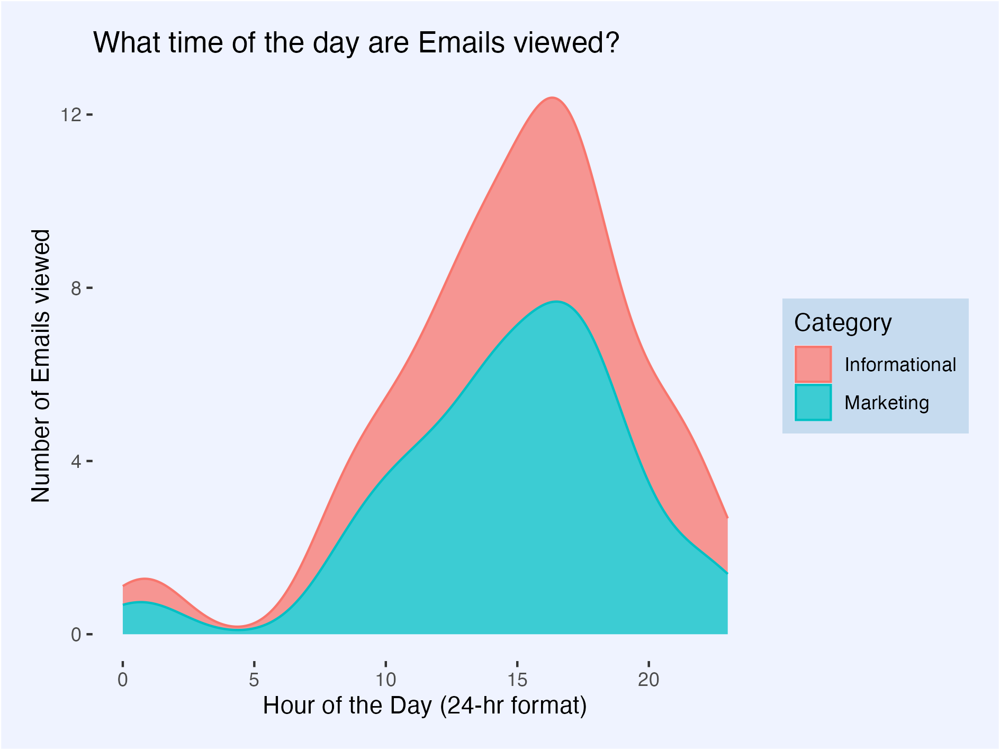
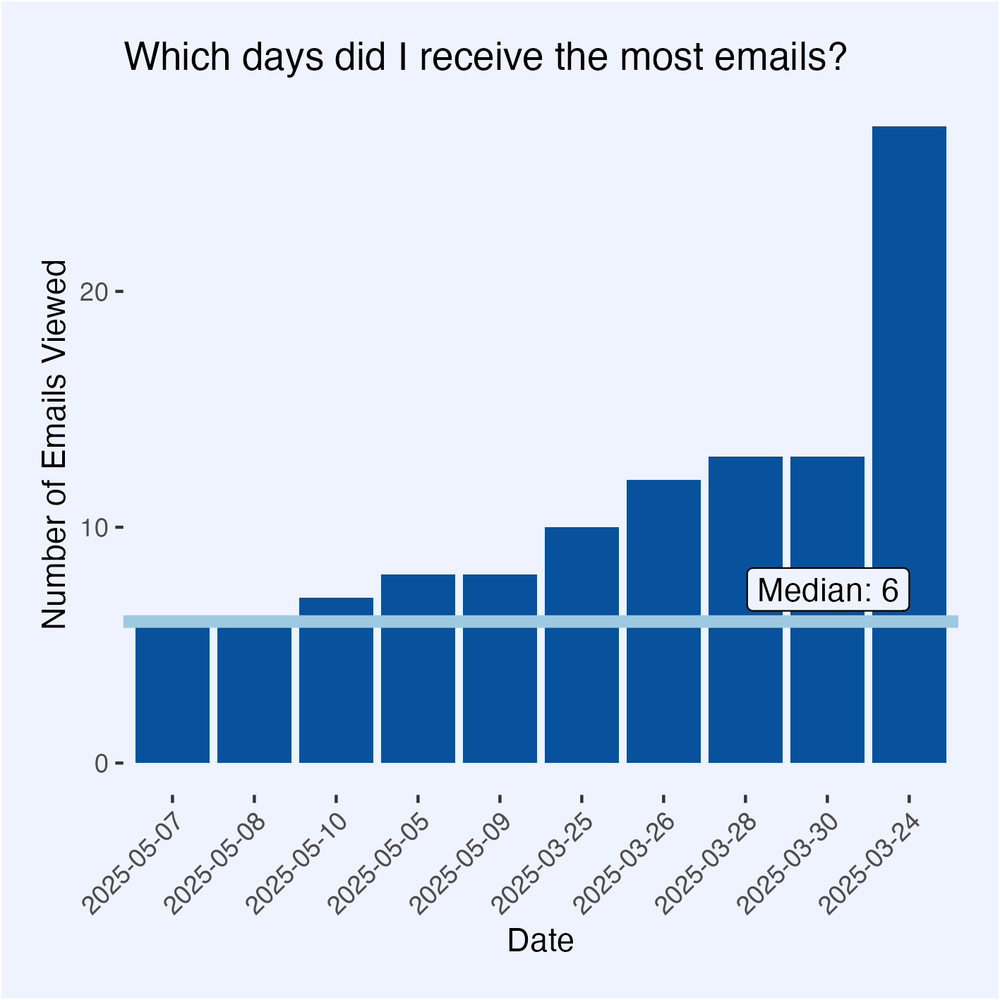

<script src="https://code.jquery.com/jquery-3.7.1.min.js" integrity="sha256-/JqT3SQfawRcv/BIHPThkBvs0OEvtFFmqPF/lYI/Cxo=" crossorigin="anonymous"></script>

```{r setup, include=FALSE}
knitr::opts_chunk$set(echo=FALSE, message=FALSE, warning=FALSE, error=FALSE)
```

```{js}
$(function() {
  $(".level2").css('visibility', 'hidden');
  $(".level2").first().css('visibility', 'visible');
  $(".container-fluid").height($(".container-fluid").height() + 300);
  $(window).on('scroll', function() {
    $('h2').each(function() {
      var h2Top = $(this).offset().top - $(window).scrollTop();
      var windowHeight = $(window).height();
      if (h2Top >= 0 && h2Top <= windowHeight / 2) {
        $(this).parent('div').css('visibility', 'visible');
      } else if (h2Top > windowHeight / 2) {
        $(this).parent('div').css('visibility', 'hidden');
      }
    });
  });
})
```

```{css}
.figcaption {display: none}

body {
  background-color: #eff3ff;
}

img {
  width: 100%;
  margin: 16px 0px;
}

p {
  width: 100%;
  padding: 4px;
  border-bottom: 3px solid #08519c;
  margin-bottom: 16px;
}
```

An exploration of the ins and outs of my emails, an often overlooked yet fundamental part our day-to-day lives.

## When do I actually deal with emails?



Most of the emails are distributed between daylight hours, but the tail ends follow my waking hours. Each category appears to follow a similar distribution centered between 3-5pm. Marketing emails appear to be the most common category, as it is the taller section throughout the graph. 

## Which days was I disturbed the most?



We can see there that there was a significantly elevated day, where the number of emails viewed was around quadruple the median. This suggests that there was likely a back-and-forth conversation that does not normally occur.

## Did the significance of the email change how long it takes to view?


The significantly right-skewed distribution of both plots shows that I aim to view emails as soon as possible. Further shown by all visible emails being viewed within an hour. For emails that were not deleted, this cuts down to viewing these emails in less than 15-20 minutes, due to the importance signified by them not being deleted. A larger proportion of deleted emails were viewed immediately as shown by a higher peak at time = 0:00:00. This is because emails that I can tell are nonsense from the notification, I will delete directly from the notification, cutting down on the time and effort required.