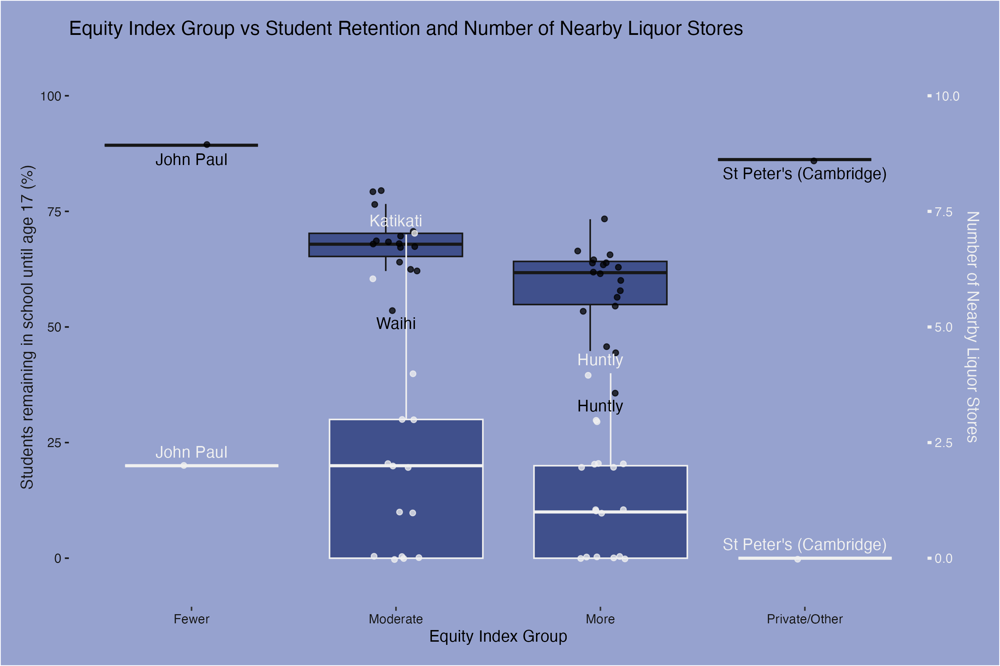

```{r setup, include=FALSE}
knitr::opts_chunk$set(echo=FALSE, message=FALSE, warning=FALSE, error=FALSE)
```

```{css}
body {
  background-color: #96A2CF;
  color: white;
}
a {
  color: #40508C;
}
```

## Introduction

I focused my investigation into secondary schools in the Bay of Plenty and Waikato regions, but outside of the major urban areas, namely including but not limited to Tauranga, and Hamilton cities. I made this choice because I grew up attending a school within this scope, and hence am most familiar with these environments. Within these areas there is often times a much higher socioeconomic barrier to success as there are far less opportunities for successful families to reside outside of major cities. As a result, I feel that poorly placed liquor stores assert a greater risk to the communities in these areas, and hence require greater focus. Upon careful consideration, I feel that it would be responsible to scrape data from Katikati College's [website](https://www.katikaticollege.school.nz) as there is no `robots.txt` file disallowing web scraping nor are there terms and conditions or some other information that discourages these actions.

## Visualisation

The purpose of this visualisation was to see whether schools whose students have differing socioeconomic barriers were more likely to be situated near liquor stores, and whether these schools had differing student retention.



## Creativity

I feel that my visualisation demonstrates creativity in mulitple ways. One of these was the way that I scraped further data from the education counts website in order to find information about how nearby liquor stores affect students. Without the student retention data, it is difficult to infer whether or not the presence of liquor stores had an effect on how students viewed school or whether this is was simply one of the factors that led to a student having greater socioeconomic barriers. Additionally, I also used a unique dual y-axis approach to better show all of this information in one visualisation.

## Learning Reflection

The most important idea that I learnt from module 5 is how simple yet powerful web scraping is. The way that the web boils down to such few key elements that we can quickly find by hand and then apply, is such an exciting concept considering the bountiful supply of data on the internet. As we begin module 6, the idea of automating the processes we have learnt throughout the course is intriguing. This concept would enable a wide array of ideas to be possible or significantly more useful without increasing the workload greatly. For example, the observational logging we did for previous projects was a tedious and unreliable source of data as there were many incidents of forgetting or failing to fill in the google forms. If we could instead use an automated approach such as was shown in examples, the data would suddenly have far more meaning behind it.

## Self Review

By completing the project set in this course, I have especially developed the skills outlines in learning outcome 2. As I came into this course a complete beginner in using the R programming language, I have had a significant increase in my capabilities of writing R code. This is most noticeable upon completing the last two projects which I found to be the most technically challenging thus far. These last two projects have had a majority of their focus on creating visualisations. This has been a unique experience which as caused me to change the way in which I think when constructing the data frames.

## Appendix

```{r file='data_sources.R', eval=FALSE, echo=TRUE}

```
```{r file='visualisation.R', eval=FALSE, echo=TRUE}

```
